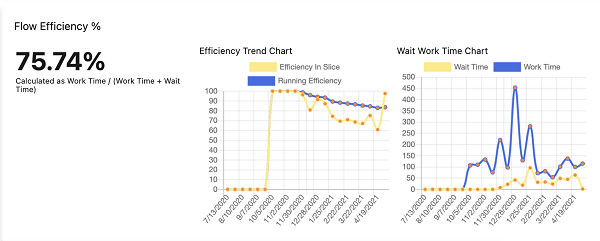

# Work Item Flow Efficiency

This Extension will give you a new hub in your Work Item that will report on your team's work item average time spent in your board columns.  It will also let you categorize your board columns in to "Wait" columns and "Work" columns, which will give your team, scrum masters, and agile coaches insight in to how much time on average your work items spend waiting on something vs. how long they are being worked on.

Users can select Board Columns to then be a "Work" or a "Wait" column so you can see the average Wait vs. Work time for your work items, which is also then used to calculate the Flow Efficiency.  

The user can select a timeframe to focus on, and the flow efficiency and the Wait & Work times and averages will be calculated for that selected timeframe.  ALSO the chart will look back over the last year and calculate and graph trends on the Flow Efficiency and the Wait and Work times in two-week increments

This extension looks at your team project's process template, so it will take in to account customizations to the process template to judge what work items fall in to your backlog, as well as getting things like what the "Completed" work item state is ("Closed", or "Done" or whatever you've customized).
## Images
The Flow Calculation and the Trend charts

The Board Columns with their Times, and how the user assigns the Wait or Work categorization

The Averages for Wait and Work for the timeframe that the user has selected

## Credits
[Jeff Przylucki](http://www.oneluckidev.com)
[Sara Caldwell](https://www.linkedin.com/in/sara-caldwell-a0906835/)